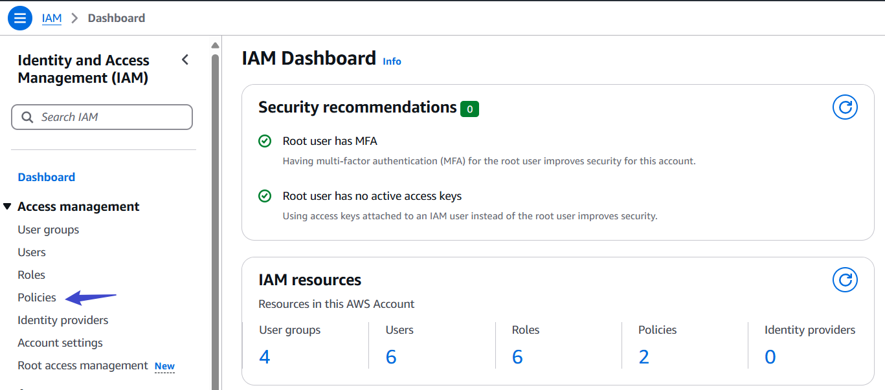

# Security and Identity Management (IAM)

### Introduction to Cloud Computing Security and Identity Management

In this project, we will be working with a hypothetical fintech startup called **Manny e-bank** .This company represents a startup venturing into the financial sector, aiming to leverage the clouds power to innovate,scale and deliver financial services

Thsi scenerio is setup to provide a realistic backdrop that will help us understand the application of AWS IAM in managing cloud resources securely and efficiently.

**The Importance of IAM for Manny e-bank**

For Manny e-bank like any other company dealing with financial services,security and compliance are paramount. The company must ensure thats its data, including sensitive customer information, is securely managed and that access to resource  is tightly controlled. AWS IAM plays a critical role in achieving these security objectives by allowing the company to define who is authenticated (**signed in**) and authorized (**has permission**) to use resources.

This project will walk us through the setting up IAM  for **Manny e-bank** creating a secure environment that reflects a real life usage and challanges. Through this hands on experience,you will learn the fundamentals of IAM, how to manage access to AWS resources,and best practises for securing your cloud environment.

### Project Set-up
1 Log into the AWS management console : Use your administrator account to log in

2 Navigate to the IAM dashboard, here you will manage users,groups,roles and policies.

### Creating IAM Users

An IAM (Identity and Access Management) user is an entity within a cloud service (like AWS) that represents a person or an application that interacts with resources. Each IAM user has specific permissions and credentials, allowing for controlled access and management of resources.

Imagine that you have a big, secure building (**AWS account**) that you own and control. When you first get the keys to the building, you are given a master key (**root user**) that can open every door, access every floor, and make changes to the building structure itself.

This master key is powerful, allowing you to do anything from adding new room (services) to changing the locks (security settings). However, because this key can do so much, its also very risky to use it for daily task.If someone else get access to the key,they can do anything with it.

Now, Imagine you have specific tasks that needs to be done in the building, like cleaning,maintenance or security checks. You wouldnt give your master key to each and every one who needs to do those job. Instead you would create specific keys (IAM users) that can only open certain doors and access certain floors.These keys are less powerful and but much safer to use for everyday tasks.They ensure the people holding them can only access certain parts of the building and nothing more.

**Lets create IAM users for:**

JOHN : A Backend Developer, requires access to serves (**EC2**) to run his code,neccessitating an IAM user with policies granting EC2 access.

MARY : A Data Analyst, needs to access data storage (**AWS S3 Storage**), so her policies should have policies enabling S3 access.

Considering **Manny e-bank** plan to expand its team with 10 more developers and 5 additional data analyst in the coming months, its inefficient to individually create similar policies for each new member. A more streamlined approach would be:

1. Crafting a single policy tailored to each roles access requirement

2. Assigning the policy to with a group specifically designed for that role.

3. Adding the respective Engineers and data analyst to their respective groups simplifying the management of permissions and ensuring consistent access accross the team.

#### Create policy for the Development Team

1 In the IAM console,click on policies

2 Click on create policy

3 In the select a service section, select EC2

4 For simplicity sake, select all the EC2 actions

5 Also make sure to select **All** in the resources section

6 Click Next

7 Provide the name **Developers** and description for the policies.

8 Click on **Create policy**

Notice that after creating the policy, if you search for  **developers** in the search box,you will notice that a number of policies are returned. This highlights the presence of AWS managed and custom managed policies.AWS managed policies are pre-configured sets of permissions created and maintained by AWS. They provide a convenient way to assign common permissions to IAM users, groups, and roles without having to define them manually.Very short summary of Custom managed policies. Custom managed policies are user-defined sets of permissions in IAM, allowing for precise control over access to AWS resources. Unlike AWS managed policies, these are tailored to meet specific requirements and are created and maintained by the user

#### Create policy for the Data Analyst Team

Repeat the process above for the **Data Analyst Team** but instead of **EC2** , search for **S3**.Also name the policy Analyst instead of developers.

#### Create Group For the Development Team

1 In the IAM console navigation, select **User group** and in the top right click **Create group**

2 Provide a name for the group

3 Attach the developer policy we created earlier to the group.This will allow any user in the **Development-Team** group to have access to EC2 instances alone.

You have successfully created a group and attach a permission policy for any user added to the group to have access to the EC2 instance only.

#### Create Group For the Data Analyst Team.

Repeat the same process above for the data Analyst Team

1. The group name should be Analyst-Team

2. Attach Analsyt policy to the group.

#### Create IAM User for JOHN

Recall that John is a backend developer, therefore he needs to be added to the **Developmet-Team** group

1 Navigate to the IAM dashboard, select "Users" and then click "Create User"

2 Review the highlights in the screenshot
 * Provide the name of the user,in this case JOHN
 * Ensure that the user can access the AWS management console.If this is not selected,the user will not be able to login from the web browser.

3 Permission : Add JOHN to the development-Team group and click "Next"

4 Click on "Create User"

5 Download the login credentials for JOHN

#### Create IAM User for MARY

Repeat the steps above and create user MARY attached to the "Analyst-Team" group.

**Testing and Validation**

Log in as JOHN : Use JOHNS credential to log in to AWS management Console.Access EC2 dashboard and perform EC2 actions.

Log in as MARY : Use MARY'S credential to log in to AWS management Console.Access S3 dashboard and perform S3 actions.

#### Implement Multi-Factor Authentication (MFA)

MFA (Multi-Factor Authentication) in AWS adds an extra layer of security to your AWS account by requiring a second form of authentication, such as a one-time password from a mobile device, in addition to your regular password. This helps protect your account from unauthorized access, even if your password is compromised.

#### Setting Up MFA For JOHN 

1 Click on "user" and click on JOHN

2 Click on "enable without MFA" and enable MFA

3 Enter a device name for JOHN MFA and select authentication app.

Install authenticator app like google or microsoft authenticator if you dont already have installed.

4  Click Next

5  Open the authenticator app on your mobile device and scan the QR code,then you can fill in the 2 consecutive codes as shown in the image below

6 By completing step 1 -5 enables MFA for john.

#### Setting Up MFA For MARY

Repeat the same process for MARY as you did for JOHN.

